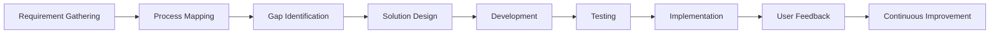

# McLarens Group  
## Business Transformation Team
 

 

<strong>Driving Digital Innovation, Automation, and Process Excellence across McLarens Group</strong>

 

 
---
 
## 🏢 About McLarens Business Transformation Team
 
The **Business Transformation Team** at **McLarens Group** focuses on improving business operations through digital solutions, process automation, workflow optimization, analytics, and enterprise application development.
 
Our goal is to support departments across the group by identifying operational challenges, improving manual processes, and delivering reliable technology-driven solutions that enhance productivity, visibility, and decision-making.
 
---
 
## 📍 Office Location
 
**McLarens Group**  
**#284, Vauxhall Street, Colombo 02, Sri Lanka**
 
---
 
## 🎯 Our Focus Areas
 
- Business process improvement
- Internal web application development
- Workflow automation
- Excel and data automation
- Dashboard and reporting solutions
- Microsoft 365 and Graph API integrations
- Process mapping and requirement analysis
- Digital transformation support
- Operational efficiency improvement
 
---
 
## 🚀 What We Do
 
We work closely with internal departments to understand their current processes, identify bottlenecks, and develop practical digital solutions that simplify day-to-day work.
 
Our work includes:
 
- Converting manual processes into digital workflows
- Building internal management systems
- Creating dashboards for better visibility
- Automating repetitive tasks
- Supporting reporting and analytics requirements
- Improving collaboration between departments
- Enhancing approval and tracking processes
 
---
 
## 🧩 Key Solution Areas
 
### 🔹 Internal Business Applications
 
Development of web-based systems to manage requests, projects, tasks, approvals, logs, reporting, and internal operations.
 
### 🔹 Automation Solutions
 
Automation of repetitive business activities using tools such as Excel automation, Python scripts, Power Automate, and workflow-based solutions.
 
### 🔹 Data & Reporting
 
Designing dashboards, reports, and analytics views to help management make faster and better decisions.
 
### 🔹 Process Optimization
 
Studying existing workflows, mapping current processes, identifying gaps, and recommending improved future-state processes.
 
### 🔹 Microsoft 365 Integration
 
Supporting solutions connected with Microsoft services such as Outlook, Teams, SharePoint, Microsoft Graph API, and Azure-based authentication.
 
---
 
## 💻 Technologies & Tools
 
### Languages
 

 
### Frontend & UI
 

 
### Backend & Databases
 

 
### Platforms & Productivity
 

 
---
 
## 📊 Business Transformation Workflow
 

 
---
 
## 🛠️ Typical Project Lifecycle
 
1. Understand the current business process
2. Collect requirements from users and stakeholders
3. Identify manual work, delays, and process gaps
4. Design the improved workflow
5. Develop the digital solution or automation
6. Test with users and refine the solution
7. Deploy the solution for business use
8. Monitor, support, and improve continuously
 
---
 
## 🌐 Our Vision
 
To support McLarens Group in becoming a more digitally enabled, efficient, data-driven, and process-focused organization through practical technology solutions and continuous business improvement.
 
---
 
## 🤝 Collaboration
 
The Business Transformation Team works with multiple departments and business units across McLarens Group to deliver solutions that are practical, scalable, and aligned with real business needs.
 
---
 
## 📫 Contact
 
**McLarens Group – Business Transformation Team**  
📍 #284, Vauxhall Street, Colombo 02, Sri Lanka  
📧 transformation@mclarens.lk
 
---
 

<strong>Business Transformation through Innovation, Automation, and Continuous Improvement</strong>

 

